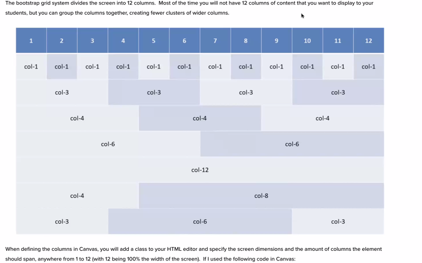

	
# Bootstrap 
- the most popular CSS Framework for developing responsive and mobile-first websites.
- Bootstrap 5 is the newest version of Bootstrap

## Which Bootstrap class provides a responsive fixed-width container?

```
.container
```
- swiss army knife of web dev
- made by twitter
- saves time, increases responsiveness
- CSS grid and flex had a baby
  
### Which Bootstrap class adds a bottom margin to an element?
1. .mb-3

### To center content vertically within a flex container in Bootstrap, which class is used?
1.  .align-items-center  
   
### What is the purpose of the col- prefix in Bootstrap's grid system?

1 . To control the number of columns an element should span

### What is the result of applying the .text-start class in Bootstrap?
1.  It aligns the text to the left

### How do you make a column occupy six grid spaces on medium-sized screens using Bootstrap?
1.   .col-md-6 

### What is the function of the .img-fluid class in Bootstrap?
1. To make an image responsive

#  Import Bootstrap to make it work
- bs5-$    is like ! 


####  Col - # makes the size of the columns - will push it out if set to large  -->



